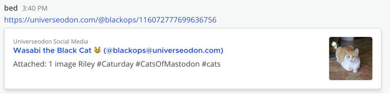
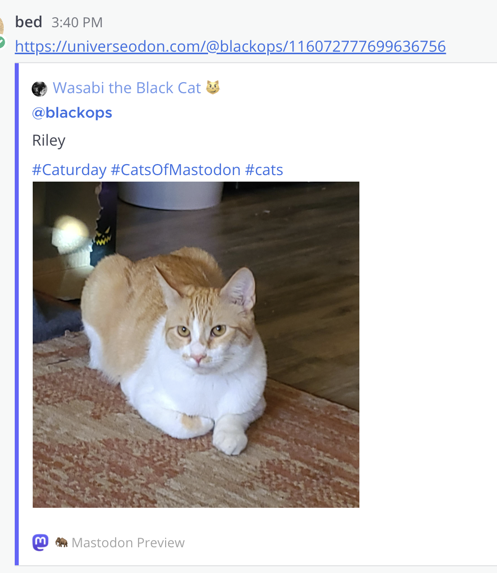
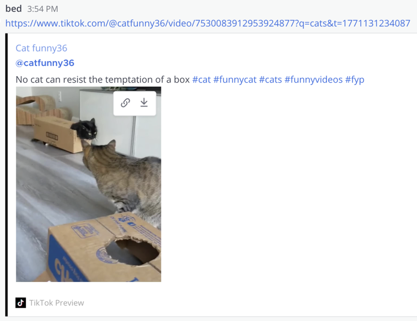

# Social Previews Plugin for Mattermost

> **Disclaimer:** This project was built with the guidance of a human developer and implemented primarily by [Claude Code](https://claude.com/claude-code) (Anthropic's AI coding assistant). I didn't have time to dev all of this by hand myself, but did have enough to guide Claude to do so! If LLM-assisted development is something you actively avoid, consider this your fair warning.

A Mattermost plugin that automatically displays rich previews for social media URLs. Supports **Mastodon**, **Bluesky**, **Twitter/X**, **Threads**, **TikTok**, and **Instagram**. Works on all platforms including **web, desktop, iOS, and Android**.

## Features

- **Multi-platform** - Previews from Mastodon, Bluesky, Twitter/X, Threads, TikTok, and Instagram
- **Generic link previews** - Fallback Open Graph previews for any URL not handled by a platform-specific handler
- **Cross-platform** - Works on all Mattermost clients (web, desktop, mobile)
- **Automatic detection** - Detects social media URLs and generates previews inline
- **Rich previews** - Shows author, avatar, content, images, web url previews and video links
- **Mastodon reply context** - Shows parent posts for Mastodon replies (both API replies and embedded quote links)
- **No configuration** - Works out of the box with default settings
- **Privacy-friendly** - Only fetches public posts, no authentication required

## The Problem

The standard web preview Mattermost provides is usually pretty bad for Mastodon posts (attached thumbnail is tiny, the displayed text is limited and gets cut off and looks ugly) and doesn't preview anything at all for most of the other popular social media platforms. Given people share links to these around all the time, I wasn't happy with this and wanted to do better.

Mattermost's default Mastodon preview:



This plugin's Mastodon preview:



Mattermost did nothing with TikTok links. This plugin's Tiktok preview:



## How it Works

The plugin uses Mattermost's **message attachments** API (same approach as GitHub and Jira plugins):

1. When a user posts a message containing a supported social media URL
2. The plugin's `MessageWillBePosted` hook detects the URL
3. The plugin fetches the post data from the platform's public API or via oEmbed
4. A rich preview attachment is added to the post
5. All clients (web, desktop, mobile) display the preview

## Supported Platforms & URL Patterns

### Mastodon (and compatible: Pixelfed, Pleroma, etc.)

- `https://mastodon.social/@username/123456789`
- `https://fosstodon.org/users/username/statuses/123456789`
- `https://instance.tld/@username@other.instance/123456789` (federated)

### Bluesky

- `https://bsky.app/profile/username.bsky.social/post/abc123`

### Twitter / X

- `https://twitter.com/username/status/123456789`
- `https://x.com/username/status/123456789`

### Threads

- `https://www.threads.net/@username/post/abc123`

### TikTok

- `https://www.tiktok.com/@username/video/123456789`

### Instagram

- `https://www.instagram.com/p/abc123/`
- `https://www.instagram.com/reel/abc123/`

### Generic Links (Fallback)

Any other URL not matching a platform above will get a fallback preview using Open Graph meta tags (`og:title`, `og:description`, `og:image`), with `<title>` and `<meta name="description">` as secondary fallbacks. This covers news sites, blogs, and other websites that Mattermost's built-in preview may not handle well.

For sites behind bot protection (e.g. Cloudflare), the plugin uses a well-known link-preview User-Agent to increase compatibility. If direct fetching still fails (e.g. DataDome-protected sites like NYT), the plugin falls back to [noembed.com](https://noembed.com) for metadata extraction.

Internal Mattermost links (matching the server's SiteURL) are automatically excluded — Mattermost handles its own permalink rendering natively.

## Preview Content

Each preview displays (where available per platform):

- **Author information** - Display name, username, and avatar
- **Post content** - Text content with HTML formatting converted to plain text
- **Media** - Images or video thumbnails (if present)
- **Poll information** - Poll vote count and status (Mastodon, Bluesky)
- **Link** - Click-through to the original post
- **URL Previews** - If a post contains a link to a url, it will fetch a preview for that url too
- **Reply context** - For Mastodon replies, shows the parent post being replied to
- **Embedded links** - Mastodon posts containing links to other Mastodon posts (e.g. quote-style "RE:" posts) will also preview the linked post

## Installation

Requirements:

- Go 1.21 or higher
- Node.js 16+ and npm 8+
- Make

```bash
# Clone the repository
git clone https://github.com/bed/mattermost-social-previews-plugin.git
cd mattermost-social-previews-plugin

# Build the plugin
make

# The plugin bundle will be created at:
# dist/social-previews-1.0.0.tar.gz
```

1. Go to **System Console > Plugins > Management**
2. Click **Upload Plugin**
3. Select the downloaded `.tar.gz` file
4. Click **Enable** on the plugin

## Usage

Simply post a social media URL in any channel or direct message:

```txt
Check out this post: https://mastodon.social/@someone/123456789
Look at this: https://bsky.app/profile/someone.bsky.social/post/abc123
```

The plugin will automatically add a rich preview below your message.

## Limitations

1. **Public posts only** - The plugin can only preview public posts (no authentication)
2. **First image only** - Only the first image attachment is shown in the preview. Additional ones are detected with links provided.
3. **Video links** - Videos do not work for inline playback. A direct link is provided instead to watch in your browser.
4. **Rate limits** - Social media platforms may rate limit requests
5. **Layout constraints** - Preview layout is constrained by Mattermost's attachment format
6. **Platform API changes** - Third-party APIs may change without notice
7. **Bot protection** - Some sites use advanced bot protection (e.g. DataDome) that blocks all server-side requests regardless of User-Agent. The noembed.com fallback covers many of these (e.g. NYT), but sites without oEmbed support that also block scraping will not get previews

## Architecture

### Server Component (Go)

| File | Role |
| ---- | ---- |
| [server/plugin.go](server/plugin.go) | Main plugin with `MessageWillBePosted` hook |
| [server/mastodon.go](server/mastodon.go) | Mastodon API client and attachment builder |
| [server/bluesky.go](server/bluesky.go) | Bluesky AT Protocol client and attachment builder |
| [server/twitter.go](server/twitter.go) | Twitter/X preview via FxTwitter API |
| [server/threads.go](server/threads.go) | Threads preview via oEmbed |
| [server/tiktok.go](server/tiktok.go) | TikTok preview via oEmbed |
| [server/instagram.go](server/instagram.go) | Instagram preview via oEmbed |
| [server/opengraph.go](server/opengraph.go) | Generic fallback preview via Open Graph meta tags + noembed.com fallback |
| [server/types.go](server/types.go) | Mastodon API data structures |
| [server/url_utils.go](server/url_utils.go) | URL pattern matching and parsing |
| [server/configuration.go](server/configuration.go) | Plugin configuration management |

## Development

### Running Tests

```bash
# Run all tests
make test

# Run Go server tests only
make test-server
```

### Deploying for Development

If your Mattermost server is running locally:

```bash
export MM_SERVICESETTINGS_SITEURL=http://localhost:8065
export MM_ADMIN_TOKEN=your-admin-token
make deploy
```

### Debugging

Enable plugin debug logging in Mattermost:

1. Go to **System Console > Environment > Logging**
2. Set **File Log Level** to `DEBUG`
3. Check logs at `/var/log/mattermost/mattermost.log`

Look for log entries prefixed with `social-previews`

## License

This project is licensed under the MIT License - see the LICENSE file for details.

## Credits

Built using the [Mattermost Plugin Starter Template](https://github.com/mattermost/mattermost-plugin-starter-template).
